# Web App — Technical Reference

## Overview

Single-page React application built with Vite, serving as the primary user interface for IntexuraOS. Uses Auth0 for authentication, Firestore for real-time data synchronization, and connects to 15+ backend microservices via REST APIs. Deploys as a Progressive Web App (PWA) to Google Cloud Storage behind a load balancer. Supports dark mode, an AI chat assistant (Intex Chat), a two-phase agent-based code task management system with a v2 task view, dynamic pipeline display, GitHub event decision log, per-user default review worker type, and a developer toolbar (DevBar) for local and dev machine environments.

## Architecture

```mermaid
graph TB
    subgraph "Client Browser"
        PWA[Progressive Web App]
        Auth0[Auth0 Lock]
        SW[Service Worker]
    end

    subgraph "Backend Services"
        USER[user-service]
        CMD[commands-agent]
        ACT[actions-agent]
        RES[research-agent]
        TODO[todos-agent]
        NOTE[notes-agent]
        BKMK[bookmarks-agent]
        CAL[calendar-agent]
        LIN[linear-agent]
        DATA[data-insights-agent]
        NOTIF[mobile-notifications]
        SETTINGS[app-settings-service]
        NOTION[notion-service]
        WA[whatsapp-service]
        CODE[code-agent]
        CHAT[chat-agent]
    end

    subgraph "Data & Auth"
        Firestore[(Firestore)]
        Auth0Svc[Auth0 API]
    end

    PWA --> Auth0Svc
    PWA --> USER
    PWA --> CMD
    PWA --> ACT
    PWA --> RES
    PWA --> TODO
    PWA --> NOTE
    PWA --> BKMK
    PWA --> CAL
    PWA --> LIN
    PWA --> DATA
    PWA --> NOTIF
    PWA --> SETTINGS
    PWA --> NOTION
    PWA --> WA
    PWA --> CODE
    PWA --> CHAT
    PWA --> Firestore
    SW --> PWA
```



## Recent Changes

| Commit     | Description                                                           | Date       |
| ---------- | --------------------------------------------------------------------- | ---------- |
| `845ee12c` | Dynamic pipeline display for code tasks                               | 2026-03-14 |
| `1d32fd31` | Improve Worker Settings UI with spacing and in-button spinner         | 2026-03-14 |
| `fcb317e9` | Use createdAt fallback for started-time sort; clean up v8-ignore      | 2026-03-13 |
| `56eec5d0` | Add default review worker type per-user setting                       | 2026-03-13 |
| `80ea775d` | Redesign Code Tasks TIME column to show Created/Started timestamps    | 2026-03-13 |
| `c55fdf79` | Use raw GitHub event names and compact inline layout for PR Events    | 2026-03-12 |
| `848ffb6a` | Rewrite PR Events page; add Firestore rules for event log entries     | 2026-03-12 |
| `2284f068` | INT-831: Add GitHub event decision log                                | 2026-03-12 |
| `e7bbfd15` | Carry forward review fields on resumed-after-success; fix Linear slug | 2026-03-11 |
| `89f3b9e1` | Use shared CodeTaskWorkerType in CodeTaskViewPage                     | 2026-03-11 |
| `c63d06fd` | Add code task logs preview modal                                      | 2026-03-10 |
| `56eec5d0` | feat(code-agent, web): add default review worker type per-user        | 2026-03-13 |

## Application Structure

```
apps/web/src/
├── components/         # Reusable UI components
│   ├── ui/             # Base UI components (Button, Card, Input)
│   ├── Chat/           # Chat system (FAB, Panel, BottomSheet, Message, Input)
│   ├── devbar/         # DevBar sub-components (tabs, filters, resize)
│   ├── code-tasks/     # Code task components
│   │   ├── v2/         # V2 task view components (V2TaskHeader, V2LogStream,
│   │   │               #   V2TaskActions, V2NextSteps, V2MessageInput, shared)
│   │   ├── CodeTaskLogViewer.tsx   # Reusable log viewer component
│   │   ├── IssueGroupRow.tsx       # Issue group row in pipeline display
│   │   └── IssueTimeline.tsx       # Timeline for code task issues
│   ├── ActionItem.tsx          # Single action display with buttons
│   ├── CodeTaskLogsModal.tsx   # Modal preview of code task logs
│   ├── DevBar.tsx              # Developer toolbar (dev only)
│   ├── GitHubEventLogRow.tsx   # GitHub event decision log row
│   ├── Layout.tsx              # Main app layout with sidebar
│   ├── Header.tsx              # Top navigation bar with theme toggle
│   ├── PREventsGroup.tsx       # PR events grouping component
│   ├── LinearIssueSelectorModal.tsx  # Modal for selecting Linear issues
│   ├── TaskConflictModal.tsx   # 409 conflict resolution modal
│   ├── TaskErrorModal.tsx      # Error-code-specific modal with actions
│   └── ...
├── context/            # React context providers
│   ├── AuthContext.tsx     # Auth0 authentication wrapper
│   ├── SyncQueueContext.tsx # Offline sync queue
│   ├── ThemeContext.tsx    # Dark/light/system theme management
│   └── pwa-context.tsx    # PWA install prompts and update detection
├── hooks/              # Custom React hooks
│   ├── useApiClient.ts    # API request wrapper with auth
│   ├── useActionChanges.ts # Firestore listener for actions
│   ├── useBookmarks.ts     # Bookmark CRUD
│   ├── useBookmarkChanges.ts # Firestore listener for bookmarks
│   ├── useCalendarEvents.ts  # Calendar event list with filtering
│   ├── useChartDefinition.ts # Chart definition management
│   ├── useChartPreview.ts    # Chart preview rendering
│   ├── useCodeTasks.ts    # Code task CRUD + pagination + workers status
│   ├── useCodeTaskLogs.ts # Firestore real-time log streaming
│   ├── useCompositeFeeds.ts  # Composite feed management
│   ├── useCreateVisualization.ts # Create visualization mutations
│   ├── useDataInsights.ts    # Data insights feed data
│   ├── useDataSources.ts     # Static data source management
│   ├── useDevBarState.ts  # DevBar persistence and state
│   ├── useFailedCalendarEvents.ts # Failed calendar event recovery
│   ├── useFailedLinearIssues.ts  # Failed Linear issue tracking
│   ├── useGitHubEventLog.ts # GitHub event decision log (Firestore)
│   ├── useGitHubPREvents.ts # GitHub PR event details (lazy-loaded)
│   ├── useGitHubPRSummaries.ts # GitHub PR summary list
│   ├── useLinearIssueOptions.ts # Linear issue selection options
│   ├── useLlmKeys.ts       # LLM API key management
│   ├── useNotes.ts         # Note CRUD
│   ├── usePm2Logs.ts     # PM2 log streaming via SSE
│   ├── usePubSubEvents.ts # Pub/Sub event streaming via SSE
│   ├── useResearch.ts      # Research report management
│   ├── useTaskView.ts      # Code task detail view state and actions
│   ├── useTodos.ts         # Todo CRUD
│   ├── useUsageCosts.ts    # LLM usage cost data
│   ├── useVisualizations.ts  # Saved visualization management
│   ├── useWorkerSettings.ts # Worker config management
│   └── ...
├── pages/              # Route components
│   ├── HomePage.tsx           # Public landing page
│   ├── LoginPage.tsx          # Auth0 login
│   ├── InboxPage.tsx          # Unified commands/actions inbox
│   ├── CodeTasksPage.tsx      # Code task list with multi-status filter
│   ├── CodeTaskNewPage.tsx    # Create new code task (form + modal)
│   ├── CodeTaskViewPage.tsx   # Code task detail (legacy v1)
│   ├── CodeTaskViewPageV2.tsx # Code task detail (v2 — current default)
│   ├── PREventsPage.tsx       # GitHub event decision log
│   ├── WorkerSettingsPage.tsx # Worker configuration with reorder
│   ├── ResearchAgentPage.tsx  # Research query form
│   ├── CalendarPage.tsx       # Calendar events list
│   ├── LinearIssuesPage.tsx   # 3-column board with sub-issues and assignees
│   ├── VisualizationsListPage.tsx # Saved data visualizations
│   └── ...
├── services/           # API client functions
│   ├── apiClient.ts       # Base API request handler
│   ├── chatService.ts     # Chat agent API + session persistence
│   ├── codeAgentApi.ts    # Code agent API (tasks, workers, PR events)
│   ├── errorConfig.ts     # Declarative error display configuration
│   ├── linearApi.ts       # Linear API (connection, issues, webhook config, sync)
│   ├── researchSettingsApi.ts # Research Notion export settings
│   ├── whatsappApi.ts     # WhatsApp API (verification, messages, media)
│   ├── workerSettingsApi.ts # Worker settings CRUD + connectivity testing
│   └── ...
├── types/              # TypeScript type definitions
│   ├── actionConfig.ts    # Action button config types
│   ├── chat.ts            # Chat message, session, response types
│   └── index.ts           # All shared types
├── utils/              # Utility functions
│   ├── dateFormat.ts      # Centralized date/time formatting
│   ├── dateUtils.ts       # Calendar date utilities
│   ├── markdownUtils.ts   # Markdown/HTML stripping
│   ├── todoItemSort.ts    # Todo sorting logic
│   └── imageProxy.ts      # Image proxy URL builder
├── config.ts           # Environment configuration (getConfig)
├── App.tsx             # Main app with routing and providers
└── index.tsx           # Application entry point
```

## Routes

| Route                                   | Page                              | Auth Required                   | Purpose                              |
| --------------------------------------- | --------------------------------- | ------------------------------- | ------------------------------------ |
| `/`                                     | HomePage                          | No                              | Public landing page                  |
| `/login`                                | LoginPage                         | No (redirects if authenticated) | Auth0 login                          |
| `/inbox`                                | InboxPage                         | Yes                             | Commands and actions queue           |
| `/research`                             | ResearchListPage                  | Yes                             | Research reports list                |
| `/research/new`                         | ResearchAgentPage                 | Yes                             | Create new research query            |
| `/research/:id`                         | ResearchDetailPage                | Yes                             | Research report detail               |
| `/code-tasks`                           | CodeTasksPage                     | Yes                             | Code task list                       |
| `/code-tasks/new`                       | CodeTaskNewPage                   | Yes                             | Create new code task                 |
| `/code-tasks/:id/view`                  | CodeTaskViewPageV2                | Yes                             | Code task detail v2 (current)        |
| `/code-tasks/:id`                       | CodeTaskViewPage                  | Yes                             | Code task detail v1 (legacy)         |
| `/code-tasks/pr-events`                 | PREventsPage                      | Yes                             | GitHub event decision log            |
| `/my-todos`                             | TodosListPage                     | Yes                             | Todo items                           |
| `/todos/:id`                            | TodoDetailRedirect                | Yes                             | Redirect to `/my-todos?id=`          |
| `/my-notes`                             | NotesListPage                     | Yes                             | Notes list                           |
| `/notes/:id`                            | NoteDetailRedirect                | Yes                             | Redirect to `/my-notes?id=`          |
| `/my-bookmarks`                         | BookmarksListPage                 | Yes                             | Bookmarks list                       |
| `/bookmarks/:id`                        | BookmarkDetailRedirect            | Yes                             | Redirect to `/my-bookmarks?id=`      |
| `/notes`                                | WhatsAppNotesPage                 | Yes                             | WhatsApp notes                       |
| `/calendar`                             | CalendarPage                      | Yes                             | Calendar events                      |
| `/linear`                               | LinearIssuesPage                  | Yes                             | Linear issues dashboard              |
| `/data-insights`                        | CompositeFeedsListPage            | Yes                             | Data insights feeds                  |
| `/data-insights/new`                    | CompositeFeedFormPage             | Yes                             | Create composite feed                |
| `/data-insights/visualizations`         | VisualizationsListPage            | Yes                             | Saved visualizations                 |
| `/data-insights/:feedId/visualizations` | DataInsightsPage                  | Yes                             | Saved visualizations for a feed      |
| `/data-insights/:id`                    | CompositeFeedFormPage             | Yes                             | Edit composite feed                  |
| `/data-insights/static-sources`         | DataSourcesListPage               | Yes                             | Static data sources                  |
| `/data-insights/static-sources/new`     | DataSourceFormPage                | Yes                             | Create data source                   |
| `/data-insights/static-sources/:id`     | DataSourceFormPage                | Yes                             | Edit data source                     |
| `/notifications`                        | MobileNotificationsListPage       | Yes                             | Push notifications history           |
| `/settings/whatsapp`                    | WhatsAppConnectionPage            | Yes                             | WhatsApp connection                  |
| `/settings/mobile`                      | MobileNotificationsConnectionPage | Yes                             | Mobile notification settings         |
| `/settings/notion`                      | NotionConnectionPage              | Yes                             | Notion connection                    |
| `/settings/calendar`                    | GoogleCalendarConnectionPage      | Yes                             | Google Calendar connection           |
| `/settings/linear`                      | LinearConnectionPage              | Yes                             | Linear connection + webhooks         |
| `/settings/github`                      | GitHubConnectionPage              | Yes                             | GitHub connection                    |
| `/settings/code`                        | WorkerSettingsPage                | Yes                             | Code worker configuration            |
| `/settings/api-keys`                    | ApiKeysSettingsPage               | Yes                             | LLM API key management               |
| `/settings/llm-pricing`                 | LlmPricingPage                    | Yes                             | LLM pricing configuration            |
| `/settings/usage-costs`                 | LlmCostsPage                      | Yes                             | LLM usage cost tracking              |
| `/settings/share-history`               | ShareHistoryPage                  | Yes                             | PWA share history                    |
| `/share-target`                         | ShareTargetPage                   | Yes                             | PWA share target handler             |

**Redirects (backward compatibility):** `/notion` → `/settings/notion`, `/whatsapp` → `/settings/whatsapp`, `/whatsapp-notes` → `/notes`, `/mobile-notifications` → `/settings/mobile`, `/mobile-notifications/list` → `/notifications`, `/settings/workers` → `/settings/code`.

**Note:** All routes use hash routing (`/#/path`) because the app is served from a GCS backend bucket that does not support SPA fallback.

## API Client Pattern

All API calls use the `apiRequest` function from `apiClient.ts`:

```typescript
export async function apiRequest<T>(
  baseUrl: string,
  path: string,
  accessToken: string,
  options?: RequestOptions
): Promise<T>;
```

Default timeout: 30,000 ms. Per-request override via `options.timeout`. The `useApiClient` hook wraps this with Auth0 token management:

```typescript
const { request, isAuthenticated } = useApiClient();
const data = await request<ServiceUrlType>(path, options);
```

## Real-Time Updates

The app uses Firestore listeners for real-time updates:

**Action Changes Listener:**

- `useActionChanges` creates a Firestore listener on the `actions` collection
- Tracks changed action IDs in state
- Debounced batch fetch (500 ms) to prevent excessive API calls
- Only enabled when the Actions tab is active (cost optimization)

**Command Changes Listener:**

- `useCommandChanges` listens to the `commands` collection
- Full refresh on changes (commands are less frequent than actions)

**Bookmark Changes Listener:**

- `useBookmarkChanges` tracks Firestore bookmark mutations
- Triggers re-fetch of bookmark data

**Code Task Log Streaming:**

- `useCodeTaskLogs` subscribes to Firestore for real-time log chunks on active tasks
- Active statuses that enable the listener: `dispatched`, `running`, `queued`
- Listener health tracked in `listenerHealthy` flag shown in the UI

**GitHub Event Log:**

- `useGitHubEventLog` listens to Firestore `github-event-log-entries` collection
- Supports real-time refresh indicator and manual refresh

**Linear Issues:**

- Firestore-backed real-time board — no polling needed
- Supports parent-child sub-issues displayed with indentation
- Assignee names displayed with emerald green badges

## Code Task Features

### V2 Task View

Route `/code-tasks/:id/view` renders `CodeTaskViewPageV2`, the current default task detail view. It is composed of focused sub-components:

| Component        | Purpose                                               |
| ---------------- | ----------------------------------------------------- |
| `V2TaskHeader`   | Title, status, timestamps, worker type badge          |
| `V2LogStream`    | Real-time color-coded log stream with follow mode     |
| `V2TaskActions`  | Cancel, retry, implement, delete action buttons       |
| `V2NextSteps`    | Post-completion next steps (PR links, retry prompts)  |
| `V2MessageInput` | Follow-up message input for active tasks              |

Route `/code-tasks/:id` (no `/view` suffix) renders the legacy `CodeTaskViewPage` (v1), still accessible for backward compatibility.

### Dynamic Pipeline Display

Code tasks list view shows a dynamic pipeline display — `IssueGroupRow` and `IssueTimeline` components visualize the relationship between planning and execution tasks in a grouped timeline layout.

### Time Column Redesign

The CODE TASKS list shows a TIME column with two timestamps:

- **Created** — when the task was submitted
- **Started** — when execution began (falls back to `createdAt` if `startedAt` is absent)

### Default Review Worker Type

Users can configure a preferred worker type for review tasks (`WorkerSettingsPage`). The setting is stored per-user via the code-agent API and pre-fills the worker type selector when creating or retrying code tasks that involve a review phase.

### Agent-Based Flow (Two-Phase)

Code tasks support an `agentType` field: `planning` or `execution`.

- **Planning agent:** Produces a design artifact. When an implementation task exists (`implementationTaskId`), an `ImplementationLinkBanner` appears (emerald) linking to the execution task.
- **Execution agent:** Runs code changes. A `DesignTaskBanner` (violet) links back to the parent planning task.
- **Single-phase tasks:** No banner shown.

### Log Color Codes

| Tag                          | Color   |
| ---------------------------- | ------- |
| `[user]`                     | cyan    |
| `[queued]`                   | amber   |
| `[resumed]`                  | emerald |
| `[prompt]`                   | orange  |
| `[instructions]`             | violet  |
| `[claude]`                   | blue    |
| `[tool]`                     | yellow  |
| `[error]`                    | red     |
| `[done]`                     | green   |
| `[hook]`                     | purple  |
| `[init]`                     | cyan    |
| `[system]`/`[orchestrator]`  | slate   |

Features: follow mode (auto-scroll), manual scroll override, copy-all-logs button, live indicator, line count, collapsible tool output blocks. Tool result lines (`[tool]` tag + subsequent indented lines) collapse into expandable blocks.

### Logs Preview Modal

`CodeTaskLogsModal` provides a lightweight preview of code task logs from the list view without navigating to the full task detail page. Implemented using the `CodeTaskLogViewer` component.

### GitHub Event Decision Log (PR Events Page)

`PREventsPage` shows all GitHub webhook events that passed through the system. Features:

- Firestore real-time listener via `useGitHubEventLog`
- Filter by decision status: All, Pending, Completed
- Search by repository, sender, PR number, event type
- Live connection health indicator
- Compact inline layout using raw GitHub event names

## State Management

- **React Context** — global state: auth, sync queue, PWA, theme
- **Component State** (`useState`) — local UI state per component
- **localStorage** — user preferences: active tab, filters, sidebar collapse, theme, chat sessions, chat panel size, DevBar state, default worker type (via settings API), PWA install dismissal per version
- **sessionStorage** — one-time flags: deep link fetch tracking
- **Firestore** — real-time data: actions, commands, code task logs, Linear issues, GitHub event log

## Configuration

Environment variables (prefixed `INTEXURAOS_`, read via `import.meta.env`):

| Variable                                      | Purpose                               | Required |
| --------------------------------------------- | ------------------------------------- | -------- |
| `INTEXURAOS_AUTH0_DOMAIN`                     | Auth0 domain                          | Yes      |
| `INTEXURAOS_AUTH0_SPA_CLIENT_ID`              | Auth0 SPA client ID                   | Yes      |
| `INTEXURAOS_AUTH_AUDIENCE`                    | Auth0 API audience                    | Yes      |
| `INTEXURAOS_USER_SERVICE_URL`                 | user-service endpoint                 | Yes      |
| `INTEXURAOS_WHATSAPP_SERVICE_URL`             | whatsapp-service endpoint             | Yes      |
| `INTEXURAOS_NOTION_SERVICE_URL`               | notion-service endpoint               | Yes      |
| `INTEXURAOS_MOBILE_NOTIFICATIONS_SERVICE_URL` | mobile-notifications endpoint         | Yes      |
| `INTEXURAOS_RESEARCH_AGENT_URL`               | research-agent endpoint               | Yes      |
| `INTEXURAOS_COMMANDS_AGENT_URL`               | commands-agent endpoint               | Yes      |
| `INTEXURAOS_ACTIONS_AGENT_URL`                | actions-agent endpoint                | Yes      |
| `INTEXURAOS_DATA_INSIGHTS_AGENT_URL`          | data-insights-agent endpoint          | Yes      |
| `INTEXURAOS_NOTES_AGENT_URL`                  | notes-agent endpoint                  | Yes      |
| `INTEXURAOS_TODOS_AGENT_URL`                  | todos-agent endpoint                  | Yes      |
| `INTEXURAOS_BOOKMARKS_AGENT_URL`              | bookmarks-agent endpoint              | Yes      |
| `INTEXURAOS_CALENDAR_AGENT_URL`               | calendar-agent endpoint               | Yes      |
| `INTEXURAOS_LINEAR_AGENT_URL`                 | linear-agent endpoint                 | Yes      |
| `INTEXURAOS_CODE_AGENT_URL`                   | code-agent endpoint                   | Yes      |
| `INTEXURAOS_CHAT_AGENT_URL`                   | chat-agent endpoint                   | Yes      |
| `INTEXURAOS_APP_SETTINGS_SERVICE_URL`         | app-settings-service endpoint         | Yes      |
| `INTEXURAOS_FIREBASE_PROJECT_ID`              | Firebase project ID                   | Yes      |
| `INTEXURAOS_FIREBASE_API_KEY`                 | Firebase API key                      | Yes      |
| `INTEXURAOS_FIREBASE_AUTH_DOMAIN`             | Firebase auth domain                  | Yes      |
| `INTEXURAOS_SENTRY_DSN_WEB`                   | Sentry error tracking DSN             | Yes      |
| `INTEXURAOS_ENVIRONMENT`                      | Environment name (e.g. `development`) | No       |
| `INTEXURAOS_BUILD_VERSION`                    | Auto-injected build version string    | No       |

In dev mode (`import.meta.env.DEV`), all service URLs use relative `/api/<service>` paths proxied by Vite instead of absolute service URLs.

## PWA Configuration

The app uses `vite-plugin-pwa` with Workbox:

- **Manifest:** Standalone display mode, portrait orientation
- **Share Target:** Handles shared links/text from other apps via URL query params
- **Cache Strategy:**
  - JS/CSS: StaleWhileRevalidate (7 days)
  - Images: CacheFirst (30 days)
  - Fonts: CacheFirst (1 year)
  - API requests: no caching (bypassed)
- **Service Worker:** Auto-update with `skipWaiting: true`
- **Max file size:** 5 MB (large libraries: Vega, Auth0 Lock, Chat)
- **Install detection:** Per-version dismissal via `intexuraos_install_dismissed_version` key in localStorage

## Action Configuration

Buttons on action items are generated from `public/action-config.yaml`:

```yaml
buttons:
  - id: approve
    label: Approve
    endpoint:
      path: /actions/{actionId}/approve
      method: PATCH
    displayOn:
      status: awaiting_approval
```

`actionConfigLoader` reads this at runtime; `ActionItem` renders buttons based on current action state.

## Firebase Integration

**Authentication:**

- `authenticateFirebase()` exchanges Auth0 JWT for Firebase custom token via user-service
- `isFirebaseAuthenticated()` checks whether a valid token is cached
- Tokens cached in module-level state

**Firestore:**

- `getFirestoreClient()` returns the Firestore instance
- Initialized with `persistentLocalCache` + `persistentMultipleTabManager` (IndexedDB, cost optimization)
- Used for real-time listeners on `actions`, `commands`, `linear-issues`, code task log collections, and `github-event-log-entries`

## Error Handling

**API Errors:**

- `ApiError` class: `code`, `message`, `status`, `details`
- Displayed as red alert banners in pages
- Default timeout: 30 s (configurable per request via `options.timeout`)
- `errorConfig.ts` maps error codes to icons, colors, titles, messages, and action buttons
- `TaskErrorModal` for code task errors — `WORKER_NOT_CONFIGURED` navigates to worker settings
- 409 Conflict responses parsed into structured `ConflictErrorInfo` for `TaskConflictModal`
- Non-JSON responses (502/503/504) handled with user-friendly messages

**Sentry:**

- Initialized in `index.tsx`
- `sendDefaultPii: true` for user context
- Traces sample rate: 100%

## Technology Stack

| Layer      | Technology                                                                |
| ---------- | ------------------------------------------------------------------------- |
| Framework  | React with TypeScript                                                     |
| Build      | Vite                                                                      |
| Styling    | TailwindCSS (dark mode support)                                           |
| Auth       | Auth0 SPA SDK (`@auth0/auth0-react`)                                      |
| Real-time  | Firebase SDK (Firestore)                                                  |
| PWA        | vite-plugin-pwa, Workbox                                                  |
| Icons      | lucide-react                                                              |
| Charts     | Vega, Vega-Lite, Vega-Embed                                               |
| Log stream | Custom component (CSS color-coded, collapsible tool blocks, no xterm.js)  |
| Markdown   | @uiw/react-md-editor, react-markdown, remark-gfm, rehype-highlight        |
| Error      | @sentry/react                                                             |
| Deployment | GCS + Cloud Load Balancer                                                 |

## Deployment

Built via Cloud Build:

1. TypeScript compilation
2. Vite production build (with `COMMIT_SHA` and `COMMIT_MESSAGE` env vars injected)
3. Upload to GCS bucket
4. Invalidate Cloud CDN cache

The app serves from `https://app.intexuraos.com` (production) or `https://dev.intexuraos.com` (development).

## Gotchas

- **Hash routing required:** GCS bucket does not support SPA fallback — all routes use `/#/path`
- **Share target redirect:** `App.tsx` runs a startup IIFE that detects share target query params and rewrites to `/#/share-target?…` before React mounts — must run before hash routing initializes
- **Firestore listener cleanup:** Listeners must be unsubscribed when components unmount or tabs switch; failure to do so causes stale updates and extra Firestore reads
- **Auth0 token cache:** Uses `localstorage` cache location to persist sessions across reloads
- **CostGuard markers:** Comments marked `CostGuard` indicate cost optimization patterns — batching, debouncing, conditional listeners
- **Vega bundle size:** Chart library is large; max file size for service worker caching is 5 MB
- **Dev mode proxying:** When `import.meta.env.DEV` is true, service URLs are relative paths (`/api/code`) proxied by Vite — never absolute URLs in dev
- **DevBar visibility:** Only renders in dev environments (`import.meta.env.DEV`) and on `dev.intexuraos.cloud`; never visible in production
- **Chat guest sessions:** Unauthenticated users can use the chat via `X-Guest-Session` header; session ID persists in localStorage with rate limiting enforced server-side
- **CodeTaskViewPage keying:** Both `CodeTaskViewPageKeyed` and `CodeTaskViewPageV2Keyed` mount with `key={id}` to fully remount when navigating between tasks
- **PR events lazy loading:** `PREventsPage` loads summaries first via `useGitHubPRSummaries`; individual event details load lazily via `useGitHubPREvents` when a PR group is expanded
- **Worker secret autofill:** Secret input fields use `autoComplete="new-password"` to prevent browser autofill (INT-501)
- **`/settings/workers` redirect:** Old URL permanently redirects to `/settings/code` for backward compatibility
- **Started-time sort fallback:** When `startedAt` is absent on a code task, the TIME column and sort logic fall back to `createdAt`
