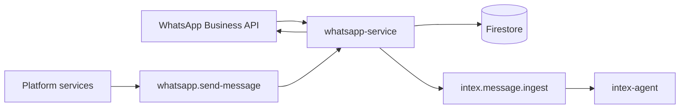

# WhatsApp Service Technical Reference

WhatsApp Service owns the WhatsApp Business API boundary: webhook verification, webhook persistence, inbound text routing, outbound sends, media cleanup, and phone verification.

## Architecture

## Internal Routes

| Method | Path | Purpose |
| --- | --- | --- |
| `POST` | `/internal/whatsapp/pubsub/process-webhook` | Process persisted webhook events |
| `POST` | `/internal/whatsapp/pubsub/send-message` | Send outbound WhatsApp messages |
| `POST` | `/internal/whatsapp/pubsub/cleanup-media` | Delete expired stored media |

Every internal route must call `logIncomingRequest()` before auth validation.

## Event Contract

| Event | Purpose |
| --- | --- |
| `intex.message.ingest` | Text message payload for Intex |
| `whatsapp.message.send` | Outbound message request |
| `whatsapp.media.cleanup` | Media cleanup request |

## Voice Boundary

Audio/voice webhook events do not publish transcription jobs for Intex. They send the unsupported voice reply and complete the webhook without creating an Intex message event.

