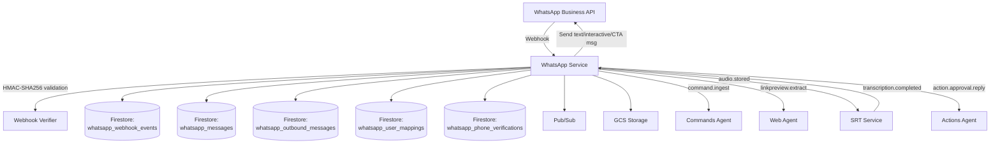
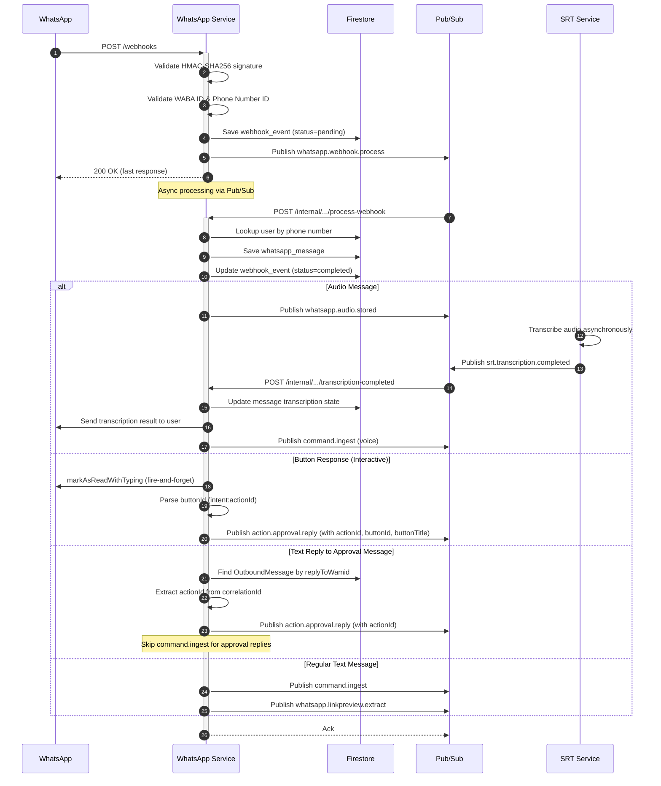
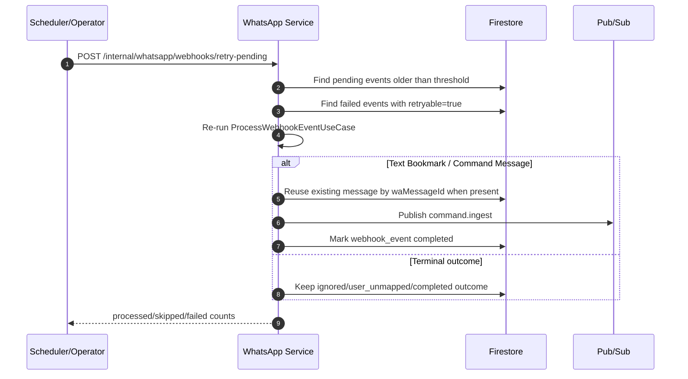
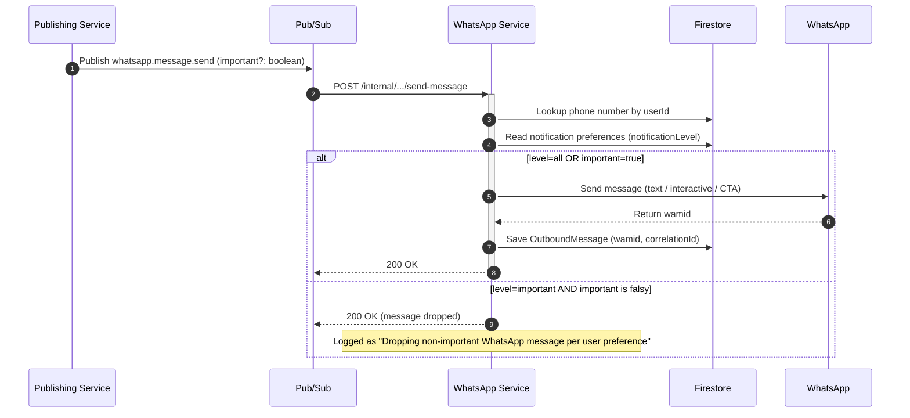
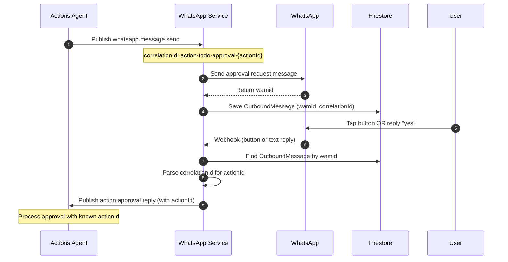

# WhatsApp Service — Technical Reference

## Overview

WhatsApp-service is the integration layer between WhatsApp Business API and IntexuraOS. It receives webhooks from Meta, validates signatures, stores messages in Firestore, downloads media to GCS, tracks outbound messages for reply correlation, filters outbound deliveries by user notification preferences, and publishes events via Pub/Sub for async processing. Audio transcription is delegated to srt-service via event-driven architecture. The app is a Fastify service in the dev/prod PM2 deployment path, using retained GCP data-plane resources for Firestore, GCS, and Pub/Sub.

## Architecture



## Data Flow

### Inbound Message Flow



### Webhook Recovery Flow



### Outbound Message Flow (with Notification Importance Filter)



### Approval Reply Correlation



## Recent Changes

| Commit     | Description                                                                 | Date       |
| ---------- | --------------------------------------------------------------------------- | ---------- |
| `5987ee4d` | Add WhatsApp bookmark recovery and retry-pending webhook processing         | 2026-06-11 |
| `737a2e7f` | Normalize provider webhook URLs around `/webhooks`                          | 2026-06-03 |
| `70fd49d9` | Normalize public API resource paths behind `/api/whatsapp`                  | 2026-06-03 |
| `54275940` | Make critical Pub/Sub topics non-nullable at the type level                 | 2026-04-23 |
| `70fa2618` | Fail audio webhook when `whatsapp.audio.stored` publish fails               | 2026-04-23 |
| `62d6d647` | Add GET/PUT `/preferences` endpoints for notification level                 | 2026-04-21 |
| `85a49b38` | Filter WhatsApp deliveries by notification importance level                 | 2026-04-20 |

### Reliable Voice Transcription Dispatch (INT-1451)

Audio webhooks now publish `whatsapp.audio.stored` from `ProcessAudioMessageUseCase` before the webhook event is marked `completed`. If the publish fails, the service updates `whatsapp_webhook_events/{eventId}` to `failed` with `failureDetails` and logs `event: 'audio_publish_failed'`, instead of acknowledging a webhook whose transcription was never dispatched. `INTEXURAOS_PUBSUB_AUDIO_STORED_TOPIC`, `INTEXURAOS_PUBSUB_APPROVAL_REPLY_TOPIC`, and `INTEXURAOS_PUBSUB_COMMANDS_INGEST_TOPIC` are required service config fields, and `GcpPubSubPublisher` guards them at construction.

### Bookmark Recovery Flow (INT-1662)

Text webhook processing now treats command ingestion as required for bookmark flows. `ProcessWebhookEventUseCase` reuses an existing message when a retry sees the same WhatsApp message ID, marks command-ingest publish failures as `failed` with `retryable: true`, and distinguishes retryable failures from terminal unexpected failures. The internal retry endpoint drains old `pending` events and explicitly retryable failed events so stalled WhatsApp bookmark captures can be replayed through the same domain use case.

### Public Path and Webhook Normalization

Service-local public routes are mounted behind `/api/whatsapp` by the web/API layer. Provider configuration should target `https://intexuraos.cloud/api/whatsapp/webhooks`, while the service route remains `/webhooks`. Internal Pub/Sub and scheduler routes stay under `/internal/whatsapp/...`.

### Notification Importance Filter (INT-1418)

Users can suppress low-priority WhatsApp notifications by setting their notification level to `important`. The feature spans:

1. **Domain model:** `NotificationPreferences` with `notificationLevel: 'all' | 'important'`
2. **Use case:** `shouldDeliverMessage()` — returns `true` when level is `all` or when the message is flagged `important`
3. **Repository:** `NotificationPreferencesRepository` stores the level on the `whatsapp_user_mappings/{userId}` document (private `notificationLevel` field)
4. **Endpoints:** `GET /preferences` and `PUT /preferences` for reading and updating the level
5. **Send-message handler:** Before sending, reads the user's preference and drops non-important messages when level is `important`
6. **Privacy contract:** The notification level is never returned by `/status`, never published on Pub/Sub, and never read by other services

### Sentry Quota Protection (INT-1172)

WhatsApp API errors in `sender.ts` now use `SKIP_SENTRY_KEY` on all error log entries. This prevents expected transient failures (network timeouts, Meta API errors) from consuming Sentry quota. The fix applies to three paths: non-2xx API responses, request timeouts, and fetch exceptions. Additionally, HTTP 429 (rate limit) responses are excluded from the permanent error classification in the send-message Pub/Sub handler, ensuring they are retried via Pub/Sub instead of being silently acknowledged.

## API Endpoints

### Webhook Endpoints

| Method | Path                 | Description                                  | Auth           |
| ------ | -------------------- | -------------------------------------------- | -------------- |
| GET    | `/webhooks` | Webhook verification (returns hub.challenge) | None           |
| POST   | `/webhooks` | Receive webhook events                       | HMAC signature |

### Public Endpoints

| Method | Path                                       | Description                                | Auth         |
| ------ | ------------------------------------------ | ------------------------------------------ | ------------ |
| GET    | `/messages`                       | List user's messages (paginated)           | Bearer token |
| GET    | `/messages/:message_id/media`     | Get signed URL for media                   | Bearer token |
| GET    | `/messages/:message_id/thumbnail` | Get signed URL for thumbnail               | Bearer token |
| DELETE | `/messages/:message_id`           | Delete message                             | Bearer token |
| POST   | `/connect`                        | Connect/update mapping (requires verified) | Bearer token |
| GET    | `/status`                         | Get mapping status                         | Bearer token |
| DELETE | `/disconnect`                     | Disconnect mapping                         | Bearer token |
| POST   | `/verify/send`                    | Send phone verification code               | Bearer token |
| POST   | `/verify/confirm`                 | Confirm verification code                  | Bearer token |
| GET    | `/verify/status/:phone`           | Check phone verification status            | Bearer token |
| GET    | `/preferences`                    | Get notification preferences               | Bearer token |
| PUT    | `/preferences`                    | Update notification preferences            | Bearer token |

### Internal Endpoints

| Method | Path                                                | Description                                             | Auth         |
| ------ | --------------------------------------------------- | ------------------------------------------------------- | ------------ |
| POST   | `/internal/whatsapp/pubsub/process-webhook`         | Process webhook or link preview extraction from Pub/Sub | Pub/Sub push or internal auth |
| POST   | `/internal/whatsapp/pubsub/transcription-completed` | Handle transcription result from srt-service            | Pub/Sub push or internal auth |
| POST   | `/internal/whatsapp/pubsub/send-message`            | Send WhatsApp message (text, interactive, or CTA)       | Pub/Sub push or internal auth |
| POST   | `/internal/whatsapp/pubsub/media-cleanup`           | Delete GCS media files                                  | Pub/Sub push or internal auth |
| POST   | `/internal/whatsapp/webhooks/retry-pending`         | Retry pending/retryable persisted webhook events        | Internal scheduler auth |

## Domain Models

### WhatsAppMessage

| Field              | Type                               | Description                        |
| ------------------ | ---------------------------------- | ---------------------------------- |
| `id`               | `string`                           | Unique message identifier          |
| `userId`           | `string`                           | User who received the message      |
| `waMessageId`      | `string`                           | WhatsApp message ID (wamid.xxx)    |
| `fromNumber`       | `string`                           | Sender's phone number (E.164)      |
| `toNumber`         | `string`                           | Recipient phone number             |
| `text`             | `string`                           | Message text content               |
| `mediaType`        | `'text' \                          | 'image' \                          | 'audio'` | Message content type |
| `gcsPath`          | `string \                          | undefined`                         | GCS path to media file |
| `thumbnailGcsPath` | `string \                          | undefined`                         | GCS path to thumbnail |
| `caption`          | `string \                          | undefined`                         | Media caption |
| `transcription`    | `TranscriptionState \              | undefined`                         | Audio transcription state |
| `linkPreview`      | `LinkPreviewState \                | undefined`                         | Extracted link metadata |
| `timestamp`        | `string`                           | WhatsApp timestamp (Unix epoch)    |
| `receivedAt`       | `string`                           | ISO 8601 webhook receive time      |
| `webhookEventId`   | `string`                           | Associated webhook event ID        |
| `metadata`         | `WhatsAppMessageMetadata \         | undefined`                         | senderName, phoneNumberId |

### NotificationPreferences

| Field               | Type                        | Description                  |
| ------------------- | --------------------------- | ---------------------------- |
| `notificationLevel` | `'all' \                    | 'important'`                 | User's notification filter |

Default: `all` (deliver every outbound message). When `important`, only messages with `important: true` on the `SendMessageEvent` are delivered. The preference is stored as a field on the `whatsapp_user_mappings/{userId}` document and is never exposed outside whatsapp-service.

### TranscriptionState

| Field         | Type                                                              | Description               |
| ------------- | ----------------------------------------------------------------- | ------------------------- |
| `status`      | `'pending' \                                                      | 'processing' \            | 'completed' \ | 'failed'` | Transcription progress |
| `jobId`       | `string \                                                         | undefined`                | Provider job ID |
| `text`        | `string \                                                         | undefined`                | Full transcribed text |
| `summary`     | `string \                                                         | undefined`                | AI-generated key points |
| `error`       | `TranscriptionError \                                             | undefined`                | Error details if failed |
| `startedAt`   | `string \                                                         | undefined`                | When processing started |
| `completedAt` | `string \                                                         | undefined`                | When completed or failed |

### OutboundMessage

Tracks sent messages for reply correlation. Uses wamid as document ID for efficient lookups.

| Field           | Type     | Description                                     |
| --------------- | -------- | ----------------------------------------------- |
| `wamid`         | `string` | WhatsApp message ID (document ID)               |
| `correlationId` | `string` | Format: `action-{type}-approval-{actionId}`     |
| `userId`        | `string` | Target user ID                                  |
| `sentAt`        | `string` | ISO 8601 send time                              |
| `expiresAt`     | `number` | Unix timestamp for TTL (7 days)                 |

### PhoneVerification

Tracks phone number verification attempts with rate limiting and cooldown.

| Field           | Type                                                         | Description                  |
| --------------- | ------------------------------------------------------------ | ---------------------------- |
| `id`            | `string`                                                     | Unique verification ID       |
| `userId`        | `string`                                                     | User requesting verification |
| `phoneNumber`   | `string`                                                     | Phone number being verified  |
| `code`          | `string`                                                     | 6-digit verification code    |
| `attempts`      | `number`                                                     | Failed attempt count         |
| `status`        | `'pending' \                                                 | 'verified' \                 | 'expired' \ | 'max_attempts'` | Verification progress |
| `createdAt`     | `string`                                                     | ISO 8601 creation time       |
| `expiresAt`     | `number`                                                     | Unix timestamp (10 min TTL)  |
| `lastAttemptAt` | `string \                                                    | undefined`                   | Last failed attempt time |
| `verifiedAt`    | `string \                                                    | undefined`                   | When verification succeeded |

### WebhookEvent

| Field            | Type                                                                                           | Description                   |
| ---------------- | ---------------------------------------------------------------------------------------------- | ----------------------------- |
| `id`             | `string`                                                                                       | Unique event ID               |
| `payload`        | `unknown`                                                                                      | Raw webhook payload           |
| `signatureValid` | `boolean`                                                                                      | Signature verification result |
| `receivedAt`     | `string`                                                                                       | ISO 8601 timestamp            |
| `phoneNumberId`  | `string \                                                                                      | null`                         | WhatsApp phone number ID |
| `status`         | `'pending' \                                                                                   | 'completed' \                 | 'failed' \ | 'ignored' \ | 'user_unmapped'` | Processing status |

### UserMapping

| Field          | Type       | Description              |
| -------------- | ---------- | ------------------------ |
| `userId`       | `string`   | User ID (document ID)    |
| `phoneNumbers` | `string[]` | Associated phone numbers |
| `connected`    | `boolean`  | Connection status        |
| `createdAt`    | `string`   | ISO 8601 creation time   |
| `updatedAt`    | `string`   | ISO 8601 update time     |

## Pub/Sub Events

### Published Events

| Event Type                     | Env Var Topic                              | Purpose                                   |
| ------------------------------ | ------------------------------------------ | ----------------------------------------- |
| `whatsapp.webhook.process`     | `INTEXURAOS_PUBSUB_WEBHOOK_PROCESS_TOPIC`  | Async webhook processing                  |
| `whatsapp.media.cleanup`       | `INTEXURAOS_PUBSUB_MEDIA_CLEANUP_TOPIC`    | Media deletion after message delete       |
| `whatsapp.audio.stored`        | `INTEXURAOS_PUBSUB_AUDIO_STORED_TOPIC`     | Audio in GCS, triggers srt-service        |
| `whatsapp.linkpreview.extract` | `INTEXURAOS_PUBSUB_WEBHOOK_PROCESS_TOPIC`  | Link preview extraction via web-agent     |
| `command.ingest`               | `INTEXURAOS_PUBSUB_COMMANDS_INGEST_TOPIC`  | Command classification (text and voice)   |
| `action.approval.reply`        | `INTEXURAOS_PUBSUB_APPROVAL_REPLY_TOPIC`   | Approval response to actions-agent        |

### Subscribed Events

| Event Type                     | Handler                                                  |
| ------------------------------ | -------------------------------------------------------- |
| `whatsapp.webhook.process`     | `POST /internal/whatsapp/pubsub/process-webhook`         |
| `whatsapp.linkpreview.extract` | `POST /internal/whatsapp/pubsub/process-webhook`         |
| `srt.transcription.completed`  | `POST /internal/whatsapp/pubsub/transcription-completed` |
| `whatsapp.message.send`        | `POST /internal/whatsapp/pubsub/send-message`            |
| `whatsapp.media.cleanup`       | `POST /internal/whatsapp/pubsub/media-cleanup`           |

### Internal Recovery Endpoint

`POST /internal/whatsapp/webhooks/retry-pending` accepts an optional JSON body:

```typescript
interface RetryPendingWebhookEventsInput {
  eventIds?: string[];
  limit?: number; // 1-100, default 50
  olderThanSeconds?: number; // default 120
  dryRun?: boolean;
}
```

Without `eventIds`, the use case searches `whatsapp_webhook_events` for `pending` events older than the threshold and `failed` events with `retryable: true`, ordered by `receivedAt`. With `dryRun: true`, matching events are reported but not replayed.

### ApprovalReplyEvent Schema

```typescript
interface ApprovalReplyEvent {
  type: 'action.approval.reply';
  replyToWamid: string;    // Original approval message wamid
  replyText: string;       // "yes"/"no"/"convert"/"cancel-task"/"view-task"/"proceed-implementation"
  userId: string;
  timestamp: string;
  actionId?: string;       // Extracted from buttonId or correlationId
  buttonId?: string;       // Button ID for interactive button clicks
  buttonTitle?: string;    // Button title for interactive button clicks
}
```

### SendMessageEvent Schema

```typescript
interface SendMessageEvent {
  type: 'whatsapp.message.send';
  userId: string;
  message: string;
  replyToMessageId?: string;
  buttons?: WhatsAppInteractiveButton[];
  ctaUrl?: { displayText: string; url: string };
  important?: boolean;      // When true, delivery bypasses 'important'-only filter
  correlationId: string;
  timestamp: string;
}
```

## Dependencies

### Firestore Collections

| Collection                     | Purpose                                                  | Owner            |
| ------------------------------ | -------------------------------------------------------- | ---------------- |
| `whatsapp_messages`            | Message persistence                                      | whatsapp-service |
| `whatsapp_webhook_events`      | Webhook event log                                        | whatsapp-service |
| `whatsapp_user_mappings`       | Phone number mappings + notification preferences         | whatsapp-service |
| `whatsapp_outbound_messages`   | Outbound message tracking                                | whatsapp-service |
| `whatsapp_phone_verifications` | Phone verification records                               | whatsapp-service |

### External APIs

| Service            | Purpose                                   |
| ------------------ | ----------------------------------------- |
| WhatsApp Cloud API | Media download, send messages, read marks |

### Internal Services

| Service        | Interface               | Purpose                                  |
| -------------- | ----------------------- | ---------------------------------------- |
| actions-agent  | `action-approval-reply` | Process approval responses               |
| commands-agent | `command-ingest`        | Command classification                   |
| web-agent      | Internal HTTP API       | Link preview Open Graph metadata         |
| srt-service    | `whatsapp-audio-stored` | Audio transcription (event-driven)       |

## Configuration

| Environment Variable                           | Required | Description                                        |
| ---------------------------------------------- | -------- | -------------------------------------------------- |
| `INTEXURAOS_AUTH_JWKS_URL`                     | Yes      | JWKS URL for JWT validation                        |
| `INTEXURAOS_AUTH_ISSUER`                       | Yes      | JWT issuer for token validation                    |
| `INTEXURAOS_AUTH_AUDIENCE`                     | Yes      | JWT audience for token validation                  |
| `INTEXURAOS_INTERNAL_AUTH_TOKEN`               | Yes      | Shared secret for internal endpoints               |
| `INTEXURAOS_USER_SERVICE_URL`                  | Yes      | User service URL for user lookup                   |
| `INTEXURAOS_GCP_PROJECT_ID`                    | Yes      | Google Cloud project ID                            |
| `INTEXURAOS_WHATSAPP_ACCESS_TOKEN`             | Yes      | WhatsApp Graph API access token                    |
| `INTEXURAOS_WHATSAPP_APP_SECRET`               | Yes      | App secret for HMAC-SHA256 signature validation    |
| `INTEXURAOS_WHATSAPP_WABA_ID`                  | Yes      | Allowed WABA IDs (comma-separated)                 |
| `INTEXURAOS_WHATSAPP_PHONE_NUMBER_ID`          | Yes      | Allowed phone number IDs (comma-separated)         |
| `INTEXURAOS_WHATSAPP_VERIFY_TOKEN`             | Yes      | Webhook verification token                         |
| `INTEXURAOS_WHATSAPP_MEDIA_BUCKET`             | Yes      | GCS bucket for media storage                       |
| `INTEXURAOS_PUBSUB_MEDIA_CLEANUP_TOPIC`        | Yes      | Media cleanup Pub/Sub topic                        |
| `INTEXURAOS_PUBSUB_MEDIA_CLEANUP_SUBSCRIPTION` | Yes      | Media cleanup subscription                         |
| `INTEXURAOS_WEB_AGENT_URL`                     | Yes      | Web-agent URL for link preview extraction          |
| `INTEXURAOS_PUBSUB_COMMANDS_INGEST_TOPIC`      | Yes      | Commands ingest topic                              |
| `INTEXURAOS_PUBSUB_WEBHOOK_PROCESS_TOPIC`      | Yes      | Webhook processing topic                           |
| `INTEXURAOS_PUBSUB_AUDIO_STORED_TOPIC`         | Yes      | Audio stored event topic (triggers srt-service)    |
| `INTEXURAOS_PUBSUB_APPROVAL_REPLY_TOPIC`       | Yes      | Approval reply topic                               |
| `INTEXURAOS_PUBSUB_WHATSAPP_SEND_TOPIC`        | Yes      | Send message topic (subscribed, not published)     |

## Gotchas

### Webhook Signature Validation

Uses HMAC-SHA256 with app secret. Signature is in `X-Hub-Signature-256` header. Uses timing-safe comparison to prevent timing attacks. Reject before any processing if invalid.

### Async Webhook Processing Pattern

The POST /webhooks handler returns 200 immediately after saving the event and publishing `whatsapp.webhook.process`. Heavy processing (media download, user lookup, Pub/Sub fan-out) happens asynchronously via the process-webhook internal endpoint. This avoids Meta's 20-second webhook timeout.

If publishing `whatsapp.webhook.process` fails, the webhook event is marked `failed` and Meta receives a 500 so it can retry the original webhook delivery.

### Voice Dispatch Reliability

For audio messages, `ProcessAudioMessageUseCase` downloads the audio, uploads it to GCS, saves the message, publishes `whatsapp.audio.stored`, and only then marks the webhook event `completed`. A failed `audio.stored` publish keeps the saved message and GCS object but marks the webhook event `failed`, making the failed transcription dispatch visible and recoverable instead of silently completing the webhook.

### Bookmark Command Recovery

For text messages, command ingestion failures are retryable. Before saving a text message during replay, the use case checks for an existing message with the same `userId` and WhatsApp `waMessageId`; if found, it reuses that message rather than creating a duplicate. It then republishes `command.ingest` and, when applicable, link preview extraction. This is the path used by `/internal/whatsapp/webhooks/retry-pending` to recover stalled WhatsApp bookmark captures.

### Notification Importance Filter (INT-1418)

The send-message Pub/Sub handler reads the user's notification preferences before sending. If `notificationLevel` is `important` and the `SendMessageEvent.important` field is absent or `false`, the message is silently dropped with a 200 OK (acknowledged, not retried). The preference defaults to `all` when no stored preference exists or when the read fails — the service falls back to delivering in case of Firestore errors. The `notificationLevel` field is stored on the `whatsapp_user_mappings/{userId}` document alongside the phone mapping data but is owned exclusively by `NotificationPreferencesRepository`. The `GET /status` endpoint never surfaces this field.

### Reply Correlation Pattern

When sending approval messages, use correlationId format: `action-{type}-approval-{actionId}`. This pattern is parsed by whatsapp-service to extract the actionId when processing text replies. Without this exact format, text replies cannot be correlated to actions.

### Preventing Duplicate Actions

When a text message is a reply to an approval message with a known actionId, the service publishes `action.approval.reply` with the actionId and skips publishing `command.ingest`. This prevents the same reply from creating duplicate actions through both approval and command flows.

### Interactive Button Format

Button ID encodes intent and target ID:

- `approve:{actionId}` — Approve action
- `cancel:{actionId}` — Cancel/reject action
- `reject:{actionId}` — Explicitly reject action
- `convert:{actionId}` — Convert action to different type
- `cancel-task:{taskId}` — Cancel a running code task
- `view-task:{taskId}` — View task status
- `proceed-implementation:{taskId}` — Proceed with implementation

Button titles are truncated to 20 characters (WhatsApp API limit).

### CTA URL Messages

When `ctaUrl` is provided in a `SendMessageEvent`, the message is sent as a WhatsApp CTA URL message with a clickable button that opens a link in the user's browser. `ctaUrl` and `buttons` are mutually exclusive — the WhatsApp API does not support both in a single message.

CTA URLs should use canonical public resource paths, for example `/api/code/...` or `/api/whatsapp/...` at the public origin. Do not include duplicated service segments such as `/api/whatsapp/whatsapp/...`.

### Read Receipts on Button Click

When a user taps an interactive button, whatsapp-service fires `markAsReadWithTyping` before publishing the approval event. This shows the user blue checkmarks and a typing indicator immediately. The call is fire-and-forget and does not block event publishing.

### Emoji Reactions No Longer Supported

Emoji reactions no longer trigger approval events. Reactions are marked as `ignored` with reason `REACTION_NOT_SUPPORTED`. Use interactive buttons instead.

### Phone Verification Flow

Phone numbers must be verified before connecting via `/connect`. The verification flow:

1. `POST /verify/send` sends a 6-digit code via WhatsApp
2. `POST /verify/confirm` validates the code
3. Once verified, `POST /connect` accepts the phone number

Rate limits: 3 requests per phone per hour, 60-second cooldown between requests. Codes expire after 10 minutes. Maximum 3 incorrect attempts before lockout.

### Event-Driven Transcription (INT-684)

Audio transcription is fully event-driven since the migration from Speechmatics direct integration. The whatsapp-service no longer calls any transcription provider directly:

1. Audio is downloaded from WhatsApp and stored in GCS
2. `whatsapp.audio.stored` event is published
3. srt-service picks up the event and handles transcription
4. srt-service publishes `srt.transcription.completed` when done
5. whatsapp-service receives the completed event, updates the message, sends the transcript to the user, and publishes `command.ingest`

### Sentry Quota Protection (INT-1172)

All WhatsApp API error logs in `sender.ts` use `SKIP_SENTRY_KEY` to prevent expected transient failures from consuming Sentry quota. This applies to non-2xx API responses, request timeouts, and fetch exceptions. The `SKIP_SENTRY_KEY` marker tells `@intexuraos/infra-sentry` to log the error without forwarding it to Sentry.

### Permanent vs Transient Error Classification

The send-message Pub/Sub handler classifies WhatsApp API errors as permanent (4xx except 429) or transient (5xx, 429, network errors). Permanent errors are acknowledged without retry — Pub/Sub does not redeliver them. Transient errors return 500, causing Pub/Sub to retry with exponential backoff. The 429 exclusion ensures rate-limited requests are retried rather than dropped.

### `extractButtonResponse()` Accepts Both Button Types

WhatsApp sends `interactive.type = "button_reply"` for button clicks in practice, but the API documentation also describes `"button"`. The `extractButtonResponse()` function in `routes/shared.ts` accepts both formats to handle API inconsistencies.

### OutboundMessage TTL

Messages in `whatsapp_outbound_messages` expire after 7 days via Firestore TTL policy. The `expiresAt` field holds a Unix timestamp. Ensure the TTL policy is configured on this field in Firestore.

### GCS Path Format

- Media: `whatsapp-media/{userId}/{messageId}.{extension}`
- Thumbnails: `whatsapp-media/{userId}/thumbnails/{messageId}.jpg`

### Signed URL Expiry

Media signed URLs expire after 15 minutes (900 seconds). Clients must regenerate via the GET media/thumbnail endpoints when needed.

### User Unmapped Handling

Messages from phone numbers not mapped to any user are marked `user_unmapped` on the webhook event but are not failed. This preserves data while allowing tracking of unmapped traffic.

### Language-Aware Transcription Messages

When sending transcription results back to users, the service uses language-specific intro phrases for summaries. Polish (`pl`) audio gets a Polish intro phrase; all other languages get English. Markdown headers in summaries are stripped before sending because WhatsApp does not render markdown headers.

### Pub/Sub Auth Detection

Internal Pub/Sub push endpoints accept Pub/Sub push requests detected via the `from: noreply@google.com` header and direct internal calls authenticated with `X-Internal-Auth`. This dual path allows the same endpoint to handle push subscriptions and operator/service calls; do not call these endpoints without one of those request shapes.

### Dev Pub/Sub Topic Aliases

In the PM2 dev environment, whatsapp-service publishes to the Pub/Sub emulator. The fallback topic names in `ecosystem.config.cjs` are emulator aliases, not Terraform topic names: `whatsapp-send-message`, `whatsapp-media-cleanup`, `whatsapp-webhook-process`, `whatsapp-transcription`, `commands-ingest`, and `approval-reply`. Keep docs and runbooks explicit about whether they refer to service env vars, emulator aliases, or retained GCP topic names.

## File Structure

```
apps/whatsapp-service/src/
  domain/
    whatsapp/
      ports/
        eventPublisher.ts
        messageSender.ts              # sendTextMessage, sendInteractiveMessage, sendCtaUrlMessage
        outboundMessageRepository.ts
        notificationPreferencesRepository.ts  # getPreferences, savePreferences
        repositories.ts               # PhoneVerificationRepository, WhatsAppMessageRepository
        whatsappCloudApi.ts           # markAsReadWithTyping
        linkPreviewFetcher.ts
        mediaStorage.ts
        thumbnailGenerator.ts
      usecases/
        processWebhookEventUseCase.ts # Orchestrates webhook handling (text, image, audio, button)
        processAudioMessage.ts        # Download + store audio in GCS
        processImageMessage.ts        # Download + thumbnail + store image
        handleTranscriptionCompleted.ts  # Handle srt-service transcription result
        extractLinkPreviews.ts        # Open Graph metadata extraction
        shouldDeliverMessage.ts       # Notification importance filter decision logic
      events/
        events.ts                     # All event type definitions (SendMessageEvent.important)
      models/
        WhatsAppMessage.ts
        NotificationPreferences.ts    # NotificationLevel, NotificationPreferences
        PhoneVerification.ts
        LinkPreview.ts
        error.ts
      utils/
  infra/
    firestore/
      webhookEventRepository.ts
      messageRepository.ts
      userMappingRepository.ts
      outboundMessageRepository.ts
      phoneVerificationRepository.ts
      notificationPreferencesRepository.ts  # Reads/writes notificationLevel on whatsapp_user_mappings
    gcs/
    whatsapp/
      cloudApiAdapter.ts              # markAsReadWithTyping
      sender.ts                       # sendInteractiveMessage, sendCtaUrlMessage (SKIP_SENTRY_KEY on errors)
    media/
    linkpreview/
      webAgentLinkPreviewClient.ts
    pubsub/
      publisher.ts
  routes/
    webhookRoutes.ts                  # Webhook validation and async dispatch
    messageRoutes.ts                  # GET /messages (list)
    messageMediaRoutes.ts             # GET media, GET thumbnail, DELETE message
    mappingRoutes.ts                  # Verification-gated connect
    preferencesRoutes.ts              # GET/PUT /preferences (INT-1418)
    pubsubRoutes.ts                   # send-message (importance filter, 429 retry), media-cleanup, transcription-completed, process-webhook
    internalRoutes.ts                 # retry-pending webhook recovery
    verificationRoutes.ts
    shared.ts                         # extractButtonResponse (button/button_reply fix)
    schemas.ts
    routes.ts
  signature.ts
  adapters.ts
  config.ts
  services.ts
  server.ts
  index.ts
```
