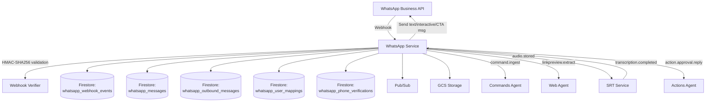
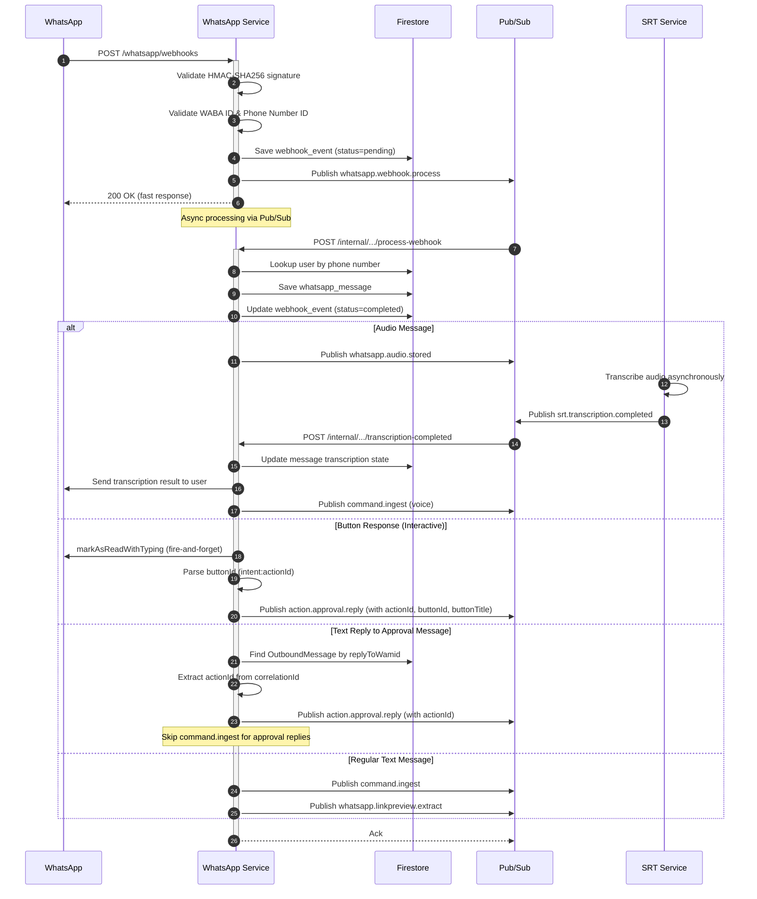
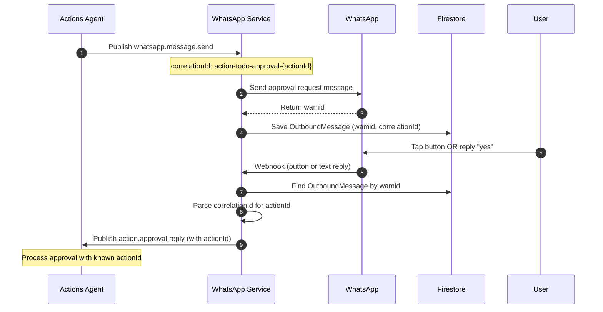

# WhatsApp Service — Technical Reference

## Overview

WhatsApp-service is the integration layer between WhatsApp Business API and IntexuraOS. It receives webhooks from Meta, validates signatures, stores messages in Firestore, downloads media to GCS, tracks outbound messages for reply correlation, and publishes events via Pub/Sub for async processing. Audio transcription is delegated to srt-service via event-driven architecture. Runs on Cloud Run with auto-scaling.

## Architecture



## Data Flow

### Inbound Message Flow



### Approval Reply Correlation



## Recent Changes

| Commit     | Description                                                              | Date       |
| ---------- | ------------------------------------------------------------------------ | ---------- |
| `f9eb2a5c` | Add tests for webhookRoutes metadata and button edge cases (INT-860)     | 2026-03-15 |
| `66b35e3e` | Add tests for sendCtaUrlMessage and remove v8 ignore markers (INT-858)   | 2026-03-15 |
| `a15e13b8` | Add tests for pubsubRoutes empty buttons routing and outbound save       | 2026-03-15 |
| `e348b66e` | Fix silent dispatch failures and nested transaction (INT-810, INT-811)   | 2026-03-10 |
| `582960d0` | Write tests for v8-ignore blocks and remove exemptions (INT-799)         | 2026-03-10 |
| `55b959e6` | Add deep link ctaUrl to WhatsApp notifications                           | 2026-03-07 |
| `a41ca812` | Replace PR URL text with WhatsApp CTA URL buttons                        | 2026-03-06 |
| `96ae9463` | Migrate from Speechmatics to event-driven transcription (INT-684)        | 2026-03-06 |

### v8 Ignore Test Replacement (INT-799, INT-858, INT-860)

Replaced v8 ignore blocks with real tests across multiple files. New test suites cover: `sender.ts` (CTA URL message formatting), `outboundMessageRepository.ts` (Firestore save/query edge cases), `pubsubRoutes.ts` (empty buttons routing, outbound message save), `webhookRoutes.ts` (metadata and button edge cases), and `webhookAsyncProcessing.ts` (comprehensive async processing paths). Remaining v8 ignore directives use documented categories: `ts-type`, `async-timing`, `test-infra`.

### Silent Dispatch Failures Fix (INT-810, INT-811)

Fixed two bugs in webhook async processing: (1) dispatch failures were silently swallowed when Pub/Sub publish failed, and (2) a nested Firestore transaction caused intermittent failures during message processing. The fix ensures dispatch errors are properly logged and surfaced.

## API Endpoints

### Webhook Endpoints

| Method | Path                 | Description                                  | Auth           |
| ------ | -------------------- | -------------------------------------------- | -------------- |
| GET    | `/whatsapp/webhooks` | Webhook verification (returns hub.challenge) | None           |
| POST   | `/whatsapp/webhooks` | Receive webhook events                       | HMAC signature |

### Public Endpoints

| Method | Path                                       | Description                                | Auth         |
| ------ | ------------------------------------------ | ------------------------------------------ | ------------ |
| GET    | `/whatsapp/messages`                       | List user's messages (paginated)           | Bearer token |
| GET    | `/whatsapp/messages/:message_id/media`     | Get signed URL for media                   | Bearer token |
| GET    | `/whatsapp/messages/:message_id/thumbnail` | Get signed URL for thumbnail               | Bearer token |
| DELETE | `/whatsapp/messages/:message_id`           | Delete message                             | Bearer token |
| POST   | `/whatsapp/connect`                        | Connect/update mapping (requires verified) | Bearer token |
| GET    | `/whatsapp/status`                         | Get mapping status                         | Bearer token |
| DELETE | `/whatsapp/disconnect`                     | Disconnect mapping                         | Bearer token |
| POST   | `/whatsapp/verify/send`                    | Send phone verification code               | Bearer token |
| POST   | `/whatsapp/verify/confirm`                 | Confirm verification code                  | Bearer token |
| GET    | `/whatsapp/verify/status/:phone`           | Check phone verification status            | Bearer token |

### Internal Endpoints

| Method | Path                                                | Description                                             | Auth         |
| ------ | --------------------------------------------------- | ------------------------------------------------------- | ------------ |
| POST   | `/internal/whatsapp/pubsub/process-webhook`         | Process webhook or link preview extraction from Pub/Sub | Pub/Sub OIDC |
| POST   | `/internal/whatsapp/pubsub/transcription-completed` | Handle transcription result from srt-service            | Pub/Sub OIDC |
| POST   | `/internal/whatsapp/pubsub/send-message`            | Send WhatsApp message (text, interactive, or CTA)       | Pub/Sub OIDC |
| POST   | `/internal/whatsapp/pubsub/media-cleanup`           | Delete GCS media files                                  | Pub/Sub OIDC |

## Domain Models

### WhatsAppMessage

| Field              | Type                               | Description                        |
| ------------------ | ---------------------------------- | ---------------------------------- |
| `id`               | `string`                           | Unique message identifier          |
| `userId`           | `string`                           | User who received the message      |
| `waMessageId`      | `string`                           | WhatsApp message ID (wamid.xxx)    |
| `fromNumber`       | `string`                           | Sender's phone number (E.164)      |
| `toNumber`         | `string`                           | Recipient phone number             |
| `text`             | `string`                           | Message text content               |
| `mediaType`        | `'text' \                          | 'image' \                          | 'audio'` | Message content type |
| `gcsPath`          | `string \                          | undefined`                         | GCS path to media file |
| `thumbnailGcsPath` | `string \                          | undefined`                         | GCS path to thumbnail |
| `caption`          | `string \                          | undefined`                         | Media caption |
| `transcription`    | `TranscriptionState \              | undefined`                         | Audio transcription state |
| `linkPreview`      | `LinkPreviewState \                | undefined`                         | Extracted link metadata |
| `timestamp`        | `string`                           | WhatsApp timestamp (Unix epoch)    |
| `receivedAt`       | `string`                           | ISO 8601 webhook receive time      |
| `webhookEventId`   | `string`                           | Associated webhook event ID        |
| `metadata`         | `WhatsAppMessageMetadata \         | undefined`                         | senderName, phoneNumberId |

### TranscriptionState

| Field         | Type                                                              | Description               |
| ------------- | ----------------------------------------------------------------- | ------------------------- |
| `status`      | `'pending' \                                                      | 'processing' \            | 'completed' \ | 'failed'` | Transcription progress |
| `jobId`       | `string \                                                         | undefined`                | Provider job ID |
| `text`        | `string \                                                         | undefined`                | Full transcribed text |
| `summary`     | `string \                                                         | undefined`                | AI-generated key points |
| `error`       | `TranscriptionError \                                             | undefined`                | Error details if failed |
| `startedAt`   | `string \                                                         | undefined`                | When processing started |
| `completedAt` | `string \                                                         | undefined`                | When completed or failed |

### OutboundMessage

Tracks sent messages for reply correlation. Uses wamid as document ID for efficient lookups.

| Field           | Type     | Description                                     |
| --------------- | -------- | ----------------------------------------------- |
| `wamid`         | `string` | WhatsApp message ID (document ID)               |
| `correlationId` | `string` | Format: `action-{type}-approval-{actionId}`     |
| `userId`        | `string` | Target user ID                                  |
| `sentAt`        | `string` | ISO 8601 send time                              |
| `expiresAt`     | `number` | Unix timestamp for TTL (7 days)                 |

### PhoneVerification

Tracks phone number verification attempts with rate limiting and cooldown.

| Field           | Type                                                              | Description                  |
| --------------- | ----------------------------------------------------------------- | ---------------------------- |
| `id`            | `string`                                                          | Unique verification ID       |
| `userId`        | `string`                                                          | User requesting verification |
| `phoneNumber`   | `string`                                                          | Phone number being verified  |
| `code`          | `string`                                                          | 6-digit verification code    |
| `attempts`      | `number`                                                          | Failed attempt count         |
| `status`        | `'pending' \                                                      | 'verified' \                 | 'expired' \ | 'max_attempts'` | Verification progress |
| `createdAt`     | `string`                                                          | ISO 8601 creation time       |
| `expiresAt`     | `number`                                                          | Unix timestamp (10 min TTL)  |
| `lastAttemptAt` | `string \                                                         | undefined`                   | Last failed attempt time |
| `verifiedAt`    | `string \                                                         | undefined`                   | When verification succeeded |

### WebhookEvent

| Field            | Type                                                                                        | Description                   |
| ---------------- | ------------------------------------------------------------------------------------------- | ----------------------------- |
| `id`             | `string`                                                                                    | Unique event ID               |
| `payload`        | `unknown`                                                                                   | Raw webhook payload           |
| `signatureValid` | `boolean`                                                                                   | Signature verification result |
| `receivedAt`     | `string`                                                                                    | ISO 8601 timestamp            |
| `phoneNumberId`  | `string \                                                                                   | null`                         | WhatsApp phone number ID |
| `status`         | `'pending' \                                                                                | 'completed' \                 | 'failed' \ | 'ignored' \ | 'user_unmapped'` | Processing status |

### UserMapping

| Field          | Type       | Description              |
| -------------- | ---------- | ------------------------ |
| `userId`       | `string`   | User ID (document ID)    |
| `phoneNumbers` | `string[]` | Associated phone numbers |
| `connected`    | `boolean`  | Connection status        |
| `createdAt`    | `string`   | ISO 8601 creation time   |
| `updatedAt`    | `string`   | ISO 8601 update time     |

## Pub/Sub Events

### Published Events

| Event Type                     | Env Var Topic                              | Purpose                                   |
| ------------------------------ | ------------------------------------------ | ----------------------------------------- |
| `whatsapp.webhook.process`     | `INTEXURAOS_PUBSUB_WEBHOOK_PROCESS_TOPIC`  | Async webhook processing                  |
| `whatsapp.media.cleanup`       | `INTEXURAOS_PUBSUB_MEDIA_CLEANUP_TOPIC`    | Media deletion after message delete       |
| `whatsapp.audio.stored`        | `INTEXURAOS_PUBSUB_AUDIO_STORED_TOPIC`     | Audio in GCS, triggers srt-service        |
| `whatsapp.linkpreview.extract` | `INTEXURAOS_PUBSUB_WEBHOOK_PROCESS_TOPIC`  | Link preview extraction via web-agent     |
| `command.ingest`               | `INTEXURAOS_PUBSUB_COMMANDS_INGEST_TOPIC`  | Command classification (text and voice)   |
| `action.approval.reply`        | `INTEXURAOS_PUBSUB_APPROVAL_REPLY_TOPIC`   | Approval response to actions-agent        |

### Subscribed Events

| Event Type                     | Handler                                                  |
| ------------------------------ | -------------------------------------------------------- |
| `whatsapp.webhook.process`     | `POST /internal/whatsapp/pubsub/process-webhook`         |
| `whatsapp.linkpreview.extract` | `POST /internal/whatsapp/pubsub/process-webhook`         |
| `srt.transcription.completed`  | `POST /internal/whatsapp/pubsub/transcription-completed` |
| `whatsapp.message.send`        | `POST /internal/whatsapp/pubsub/send-message`            |
| `whatsapp.media.cleanup`       | `POST /internal/whatsapp/pubsub/media-cleanup`           |

### ApprovalReplyEvent Schema

```typescript
interface ApprovalReplyEvent {
  type: 'action.approval.reply';
  replyToWamid: string;    // Original approval message wamid
  replyText: string;       // "yes"/"no"/"convert"/"cancel-task"/"view-task"/"proceed-implementation"
  userId: string;
  timestamp: string;
  actionId?: string;       // Extracted from buttonId or correlationId
  buttonId?: string;       // Button ID for interactive button clicks
  buttonTitle?: string;    // Button title for interactive button clicks
}
```

## Dependencies

### Firestore Collections

| Collection                     | Purpose                    | Owner            |
| ------------------------------ | -------------------------- | ---------------- |
| `whatsapp_messages`            | Message persistence        | whatsapp-service |
| `whatsapp_webhook_events`      | Webhook event log          | whatsapp-service |
| `whatsapp_user_mappings`       | Phone number mappings      | whatsapp-service |
| `whatsapp_outbound_messages`   | Outbound message tracking  | whatsapp-service |
| `whatsapp_phone_verifications` | Phone verification records | whatsapp-service |

### External APIs

| Service            | Purpose                                   |
| ------------------ | ----------------------------------------- |
| WhatsApp Cloud API | Media download, send messages, read marks |

### Internal Services

| Service        | Interface               | Purpose                                  |
| -------------- | ----------------------- | ---------------------------------------- |
| actions-agent  | `action-approval-reply` | Process approval responses               |
| commands-agent | `command-ingest`        | Command classification                   |
| web-agent      | Internal HTTP API       | Link preview Open Graph metadata         |
| srt-service    | `whatsapp-audio-stored` | Audio transcription (event-driven)       |

## Configuration

| Environment Variable                           | Required | Description                                        |
| ---------------------------------------------- | -------- | -------------------------------------------------- |
| `INTEXURAOS_AUTH_JWKS_URL`                     | Yes      | JWKS URL for JWT validation                        |
| `INTEXURAOS_AUTH_ISSUER`                       | Yes      | JWT issuer for token validation                    |
| `INTEXURAOS_AUTH_AUDIENCE`                     | Yes      | JWT audience for token validation                  |
| `INTEXURAOS_INTERNAL_AUTH_TOKEN`               | Yes      | Shared secret for internal endpoints               |
| `INTEXURAOS_USER_SERVICE_URL`                  | Yes      | User service URL for user lookup                   |
| `INTEXURAOS_GCP_PROJECT_ID`                    | Yes      | Google Cloud project ID                            |
| `INTEXURAOS_WHATSAPP_ACCESS_TOKEN`             | Yes      | WhatsApp Graph API access token                    |
| `INTEXURAOS_WHATSAPP_APP_SECRET`               | Yes      | App secret for HMAC-SHA256 signature validation    |
| `INTEXURAOS_WHATSAPP_WABA_ID`                  | Yes      | Allowed WABA IDs (comma-separated)                 |
| `INTEXURAOS_WHATSAPP_PHONE_NUMBER_ID`          | Yes      | Allowed phone number IDs (comma-separated)         |
| `INTEXURAOS_WHATSAPP_VERIFY_TOKEN`             | Yes      | Webhook verification token                         |
| `INTEXURAOS_WHATSAPP_MEDIA_BUCKET`             | Yes      | GCS bucket for media storage                       |
| `INTEXURAOS_PUBSUB_MEDIA_CLEANUP_TOPIC`        | Yes      | Media cleanup Pub/Sub topic                        |
| `INTEXURAOS_PUBSUB_MEDIA_CLEANUP_SUBSCRIPTION` | Yes      | Media cleanup subscription                         |
| `INTEXURAOS_WEB_AGENT_URL`                     | Yes      | Web-agent URL for link preview extraction          |
| `INTEXURAOS_PUBSUB_COMMANDS_INGEST_TOPIC`      | Yes      | Commands ingest topic                              |
| `INTEXURAOS_PUBSUB_WEBHOOK_PROCESS_TOPIC`      | Yes      | Webhook processing topic                           |
| `INTEXURAOS_PUBSUB_AUDIO_STORED_TOPIC`         | Yes      | Audio stored event topic (triggers srt-service)    |
| `INTEXURAOS_PUBSUB_APPROVAL_REPLY_TOPIC`       | Yes      | Approval reply topic                               |
| `INTEXURAOS_PUBSUB_WHATSAPP_SEND_TOPIC`        | Yes      | Send message topic (subscribed, not published)     |

## Gotchas

### Webhook Signature Validation

Uses HMAC-SHA256 with app secret. Signature is in `X-Hub-Signature-256` header. Uses timing-safe comparison to prevent timing attacks. Reject before any processing if invalid.

### Async Webhook Processing Pattern

The POST /whatsapp/webhooks handler returns 200 immediately after saving the event and publishing `whatsapp.webhook.process`. Heavy processing (media download, user lookup, Pub/Sub fan-out) happens asynchronously via the process-webhook internal endpoint. This avoids Meta's 20-second webhook timeout.

### Reply Correlation Pattern

When sending approval messages, use correlationId format: `action-{type}-approval-{actionId}`. This pattern is parsed by whatsapp-service to extract the actionId when processing text replies. Without this exact format, text replies cannot be correlated to actions.

### Preventing Duplicate Actions

When a text message is a reply to an approval message with a known actionId, the service publishes `action.approval.reply` with the actionId and skips publishing `command.ingest`. This prevents the same reply from creating duplicate actions through both approval and command flows.

### Interactive Button Format

Button ID encodes intent and target ID:

- `approve:{actionId}` — Approve action
- `cancel:{actionId}` — Cancel/reject action
- `reject:{actionId}` — Explicitly reject action
- `convert:{actionId}` — Convert action to different type
- `cancel-task:{taskId}` — Cancel a running code task
- `view-task:{taskId}` — View task status
- `proceed-implementation:{taskId}` — Proceed with implementation

Button titles are truncated to 20 characters (WhatsApp API limit).

### CTA URL Messages

When `ctaUrl` is provided in a `SendMessageEvent`, the message is sent as a WhatsApp CTA URL message with a clickable button that opens a link in the user's browser. `ctaUrl` and `buttons` are mutually exclusive — the WhatsApp API does not support both in a single message.

### Read Receipts on Button Click

When a user taps an interactive button, whatsapp-service fires `markAsReadWithTyping` before publishing the approval event. This shows the user blue checkmarks and a typing indicator immediately. The call is fire-and-forget and does not block event publishing.

### Emoji Reactions No Longer Supported

Emoji reactions no longer trigger approval events. Reactions are marked as `ignored` with reason `REACTION_NOT_SUPPORTED`. Use interactive buttons instead.

### Phone Verification Flow

Phone numbers must be verified before connecting via `/whatsapp/connect`. The verification flow:

1. `POST /whatsapp/verify/send` sends a 6-digit code via WhatsApp
2. `POST /whatsapp/verify/confirm` validates the code
3. Once verified, `POST /whatsapp/connect` accepts the phone number

Rate limits: 3 requests per phone per hour, 60-second cooldown between requests. Codes expire after 10 minutes. Maximum 3 incorrect attempts before lockout.

### Event-Driven Transcription (INT-684)

Audio transcription is fully event-driven since the migration from Speechmatics direct integration. The whatsapp-service no longer calls any transcription provider directly:

1. Audio is downloaded from WhatsApp and stored in GCS
2. `whatsapp.audio.stored` event is published
3. srt-service picks up the event and handles transcription
4. srt-service publishes `srt.transcription.completed` when done
5. whatsapp-service receives the completed event, updates the message, sends the transcript to the user, and publishes `command.ingest`

### `extractButtonResponse()` Accepts Both Button Types

WhatsApp sends `interactive.type = "button_reply"` for button clicks in practice, but the API documentation also describes `"button"`. The `extractButtonResponse()` function in `routes/shared.ts` accepts both formats to handle API inconsistencies.

### OutboundMessage TTL

Messages in `whatsapp_outbound_messages` expire after 7 days via Firestore TTL policy. The `expiresAt` field holds a Unix timestamp. Ensure the TTL policy is configured on this field in Firestore.

### GCS Path Format

- Media: `whatsapp-media/{userId}/{messageId}.{extension}`
- Thumbnails: `whatsapp-media/{userId}/thumbnails/{messageId}.jpg`

### Signed URL Expiry

Media signed URLs expire after 15 minutes (900 seconds). Clients must regenerate via the GET media/thumbnail endpoints when needed.

### User Unmapped Handling

Messages from phone numbers not mapped to any user are marked `user_unmapped` on the webhook event but are not failed. This preserves data while allowing tracking of unmapped traffic.

### Language-Aware Transcription Messages

When sending transcription results back to users, the service uses language-specific intro phrases for summaries. Polish (`pl`) audio gets a Polish intro phrase; all other languages get English. Markdown headers in summaries are stripped before sending because WhatsApp does not render markdown headers.

### Pub/Sub Auth Detection

Internal Pub/Sub push endpoints accept both OIDC tokens (from Cloud Pub/Sub, detected via `from: noreply@google.com` header — validated by Cloud Run before the request arrives) and `X-Internal-Auth` tokens (for direct service-to-service calls). This dual-auth pattern allows the same endpoint to handle both push subscriptions and direct internal calls.

## File Structure

```
apps/whatsapp-service/src/
  domain/
    whatsapp/
      ports/
        eventPublisher.ts
        messageSender.ts              # sendTextMessage, sendInteractiveMessage, sendCtaUrlMessage
        outboundMessageRepository.ts
        repositories.ts               # PhoneVerificationRepository, WhatsAppMessageRepository
        whatsappCloudApi.ts           # markAsReadWithTyping
        linkPreviewFetcher.ts
        mediaStorage.ts
        thumbnailGenerator.ts
      usecases/
        processAudioMessage.ts        # Download + store audio in GCS
        processImageMessage.ts        # Download + thumbnail + store image
        handleTranscriptionCompleted.ts  # Handle srt-service transcription result
        extractLinkPreviews.ts        # Open Graph metadata extraction
      events/
        events.ts                     # All event type definitions
      models/
        WhatsAppMessage.ts
        PhoneVerification.ts
        LinkPreview.ts
        error.ts
      utils/
  infra/
    firestore/
      webhookEventRepository.ts
      messageRepository.ts
      userMappingRepository.ts
      outboundMessageRepository.ts
      phoneVerificationRepository.ts
    gcs/
    whatsapp/
      cloudApiAdapter.ts              # markAsReadWithTyping
      sender.ts                       # sendInteractiveMessage, sendCtaUrlMessage
    media/
    linkpreview/
      webAgentLinkPreviewClient.ts
    pubsub/
      publisher.ts
  routes/
    webhookRoutes.ts                  # Button handling, approval detection, async dispatch
    messageRoutes.ts
    mappingRoutes.ts                  # Verification-gated connect
    pubsubRoutes.ts                   # send-message, media-cleanup, transcription-completed, process-webhook
    verificationRoutes.ts
    shared.ts                         # extractButtonResponse (button/button_reply fix)
    schemas.ts
    routes.ts
  signature.ts
  adapters.ts
  config.ts
  services.ts
  server.ts
  index.ts
```
