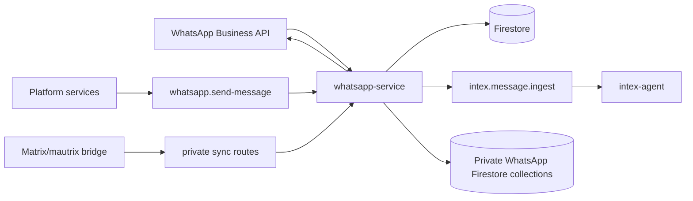

# WhatsApp Service Technical Reference

WhatsApp Service owns the WhatsApp Business API boundary: webhook verification, webhook persistence, inbound text routing, outbound sends, media cleanup, phone verification, and private WhatsApp mirror persistence.

## Architecture

## Service Container

`services.ts` wires the private workspace through `privateWhatsAppRepository`, alongside the existing webhook, message, outbound message, preferences, media, Pub/Sub, WhatsApp Cloud API, thumbnail, and link preview adapters.

## Public Routes

Routes are listed by their service-relative Fastify paths.

| Method | Path | Purpose |
| --- | --- | --- |
| `GET` | `/messages` | List assistant WhatsApp messages for the authenticated user |
| `GET` | `/private/account` | Read the authenticated user's private mirror account |
| `PUT` | `/private/account` | Enable or update the private mirror account after connected-phone validation |
| `DELETE` | `/private/account` | Disable the private mirror account |
| `GET` | `/private/chats` | List private chats for the authenticated user |
| `GET` | `/private/chats/:chatId/messages` | List private messages for one chat |
| `GET` | `/private/senders` | List private senders |
| `GET` | `/private/messages` | List private messages by sender |
| `GET` | `/private/sender-days` | List private sender-day aggregates |

Account responses expose `sourceAccountId` so the authenticated user can identify the active mirror account. Other private read responses omit owner-only storage fields such as `userId`, `sourceAccountId`, Matrix room IDs, raw Matrix events, and Matrix sender identifiers.

## Internal Routes

| Method | Path | Purpose |
| --- | --- | --- |
| `POST` | `/internal/whatsapp/pubsub/process-webhook` | Process persisted webhook events |
| `POST` | `/internal/whatsapp/pubsub/send-message` | Send outbound WhatsApp messages |
| `POST` | `/internal/whatsapp/pubsub/media-cleanup` | Delete expired stored media |
| `POST` | `/internal/whatsapp/webhooks/retry-pending` | Retry persisted webhook events |
| `POST` | `/internal/whatsapp/private/events` | Ingest private Matrix bridge events |
| `GET` | `/internal/whatsapp/private/messages` | Query private messages by source account, sender, day, and time range |
| `GET` | `/internal/whatsapp/private/sender-days` | Query private sender-day aggregates |
| `POST` | `/internal/whatsapp/private/aggregates/rebuild` | Rebuild private sender and sender-day aggregates |

Every internal route must call `logIncomingRequest()` before auth validation.

## Event Contract

| Event | Purpose |
| --- | --- |
| `intex.message.ingest` | Text message payload for Intex Agent |
| `whatsapp.message.send` | Outbound message request |
| `whatsapp.media.cleanup` | Media cleanup request |
| `whatsapp.webhook.process` | Async processing request for persisted webhook events |
| `whatsapp.linkpreview.extract` | Link preview extraction request for web-agent |

## Private Workspace Storage

The private workspace uses these Firestore collections:

| Collection | Purpose |
| --- | --- |
| `whatsapp_private_accounts` | One private mirror account per user |
| `whatsapp_private_chats` | Chat metadata keyed from source account and Matrix room ID |
| `whatsapp_private_messages` | Private messages keyed from source account and Matrix event ID |
| `whatsapp_private_senders` | Sender aggregates keyed from source account and sender key |
| `whatsapp_private_sender_days` | Sender/day aggregates keyed from source account, sender key, and day |

Private event ingest accepts `deliveryMode` values `live` and `backfill`. Message directions are `incoming` and `outgoing`; chat types are normalized to `direct`, `group`, or `unknown`; message types are normalized to text, image, audio, video, file, sticker, reaction, redaction, or unknown.

Private day keys are generated in the `Europe/Warsaw` time zone. Sender keys prefer a normalized phone number (`phone:+...`) and fall back to the Matrix sender ID (`matrix:...`) when phone metadata is missing.

## Private WhatsApp Image Storage

New private WhatsApp `image` messages synchronized from Matrix are copied into the private WhatsApp media bucket before the message event is ingested. The Matrix adapter owns Matrix media downloads. `whatsapp-service` owns GCS upload, thumbnail generation, Firestore metadata, and signed URL access.

Stored private media uses `whatsapp/private/{userId}/{messageId}/{mediaId}.{ext}` and `whatsapp/private/{userId}/{messageId}/{mediaId}_thumb.jpg`. Browser reads use owner-checked signed URL routes. Internal processors use the internal signed URL route with `sourceAccountId` validation.

Existing image messages without stored GCS metadata intentionally remain as placeholders.

## Voice Boundary

Audio/voice webhook events do not publish transcription jobs for Intex. They send the unsupported voice reply and complete the webhook without creating an Intex message event.

Button and interactive replies from retired workflows are ignored and are not routed into Intex Agent.
